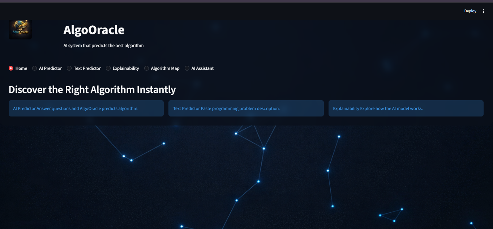
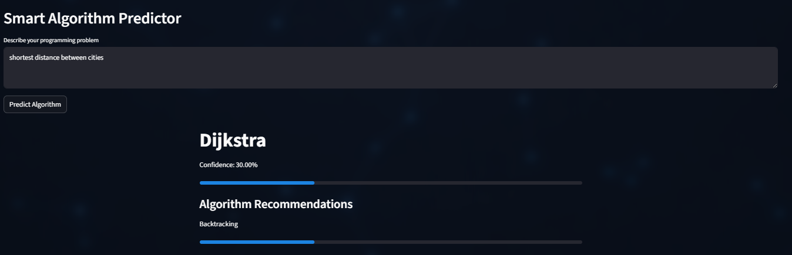
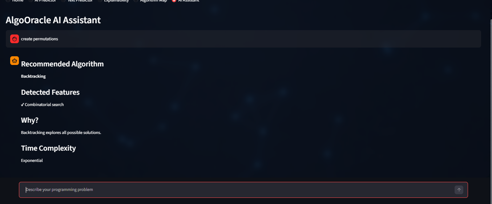
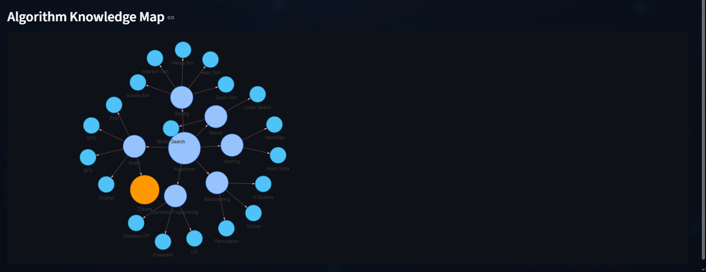

# 🚀 AlgoOracle AI  


### Intelligent Algorithm Prediction System using Machine Learning & NLP

---
[](https://zubair-khan0723-algooracle-ai-app-6wkix0.streamlit.app/)
## 🌟 Overview

**AlgoOracle** is an AI-powered system that predicts the most suitable algorithm for solving programming problems using a **Decision Tree Machine Learning model** combined with **Natural Language Processing (NLP)**.

The system intelligently analyzes problem characteristics through:

- 📊 Structured feature-based input (AI Predictor)
- 🧠 Natural language understanding (Text Predictor)
- 💬 Interactive AI Assistant

---

## 🔥 Key Highlights

- 🚀 End-to-end ML project (Data → Model → UI → Deployment)
- 🧠 Decision Tree with Explainable AI
- 💬 AI Assistant with reasoning capability
- 🌐 Deployed live using Streamlit Cloud
- 🎨 Modern AI-inspired UI/UX

---

## 🌐 Live Demo  

🔗 **Try AlgoOracle AI here:**  
👉 https://zubair-khan0723-algooracle-ai-app-6wkix0.streamlit.app/

⚡ Experience real-time algorithm prediction powered by Machine Learning & NLP.

---

## 💡 Why This Project Matters

Choosing the right algorithm is a critical skill in programming.

AlgoOracle bridges the gap between:
- ❌ Memorizing algorithms  
- ✅ Understanding when to use them  

It acts as an **AI-powered mentor** for developers.

---

## 🧠 Core Idea

Instead of memorizing algorithms, AlgoOracle helps developers:

✔ Understand *which algorithm to use*  
✔ Learn *why that algorithm is chosen*  
✔ Visualize *how the model makes decisions*  

---

## 🤖 Machine Learning Model

### 📌 Model Used: **Decision Tree Classifier**

The system is built using a **Decision Tree model** trained on algorithm characteristics.

---

### 🔍 Features Used

The model learns from features such as:

- uses_array  
- uses_graph  
- recursion  
- dynamic_programming  
- shortest_path  
- sorting  
- searching  
- sliding_window  

---

### 🧠 Why Decision Tree?

✔ Interpretable model  
✔ Works well on small datasets  
✔ Enables **Explainable AI**  
✔ Visualizes decision paths clearly  
✔ Ideal for rule-based reasoning systems  

---

## 🧠 Smart NLP Engine

- Uses rule-based NLP with contextual keyword scoring  
- Detects intent from real-world problem descriptions  
- Maps problem patterns to algorithm categories  
- Provides confidence-based predictions  

---

## 📊 Model Training Notebook

The complete ML pipeline is available in:

📁 `notebook/model_training.ipynb`

It includes:

- Data preprocessing  
- Feature engineering  
- Decision Tree training  
- Model evaluation  
- Exporting `.pkl` models  

---

## 📂 Dataset

The dataset used for training is available here:

📁 `dataset/algorithm_dataset.csv`

It contains structured features describing algorithm behavior such as:

- uses_array  
- uses_graph  
- recursion  
- dynamic_programming  
- shortest_path  

> 📌 This is a custom-designed dataset to simulate algorithm selection using ML.

---

## 🖼️ Application Preview

### 🏠 Home


---

### 🤖 AI Predictor (Decision Tree Based)


---

### 🧠 NLP Text Predictor


---

### 💬 AI Assistant with Reasoning


---

### 🌐 Algorithm Knowledge Map


---

## ✨ Key Features

### 🤖 AI Predictor (ML-Based)
- Interactive question system  
- Uses Decision Tree for prediction  
- Simulates Akinator-style algorithm guessing  

---

### 🧠 Smart NLP Predictor
- Understands real problem descriptions  
- Uses contextual keyword scoring  
- Returns prediction with confidence  

---

### 💬 AI Assistant (Reasoning Engine)
- Chat-based intelligent assistant  
- Detects problem features  
- Explains:
  - ✔ Why algorithm is chosen  
  - ✔ Time complexity  
  - ✔ Problem characteristics  

---

### 📊 Explainable AI
- Feature importance visualization  
- Decision tree structure visualization  
- Transparent model reasoning  

---

### 🌐 Algorithm Knowledge Graph
- Interactive graph visualization  
- Organized by categories  
- Dynamically highlights predicted algorithm  

---

## 🎨 UI/UX Design

- 🌌 Animated AI-themed background  
- Glassmorphism interface  
- Smooth transitions  
- AI character states:
  - Thinking 🤔  
  - Processing ⚙️  
  - Result 😄  

---

## 🛠️ Tech Stack

| Category | Technology |
|--------|-----------|
| Frontend | Streamlit |
| ML Model | Scikit-learn (Decision Tree) |
| NLP | Custom Rule-Based Engine |
| Visualization | Plotly, streamlit-agraph |
| Language | Python |

---

## 📁 Project Structure

```

AlgoOracle-AI/
│
├── app.py
├── requirements.txt
├── packages.txt
│
├── model/
│   ├── decision_tree.pkl
│   ├── label_encoder.pkl
│   └── features.pkl
│
├── notebook/
│   └── model_training.ipynb
│
├── dataset/
│   └── algorithm_dataset.csv
│
├── utils/
├── visualizations/
├── data/
│
├── assets/
│   ├── background_ai.png
│   ├── logo.png
│   ├── ai_thinking.png
│   ├── ai_processing.png
│   ├── ai_happy.png
│   └── screenshots/
│
└── README.md

````

---

## 🚀 Deployment

This application is deployed on **Streamlit Community Cloud**.

🔗 Live App:  
https://zubair-khan0723-algooracle-ai-app-6wkix0.streamlit.app/
## ⚙️ Installation

```bash
git clone https://github.com/Zubair-khan0723/AlgoOracle-AI.git
cd AlgoOracle-AI
pip install -r requirements.txt
streamlit run app.py
````

---

## 🚀 Example

### Input:

```
Find shortest distance between nodes in a weighted graph
```

### Output:

```
Algorithm: Dijkstra
Confidence: High
```

---

## 🔮 Future Improvements

* Deep Learning-based NLP model
* More algorithm coverage
* Code generation suggestions
* API deployment
* Real-time AI assistant

---

## 👨‍💻 Author

Developed  by **Zubair Khan**

---

## ⭐ Support

If you like this project, consider giving it a ⭐ on GitHub!

```


